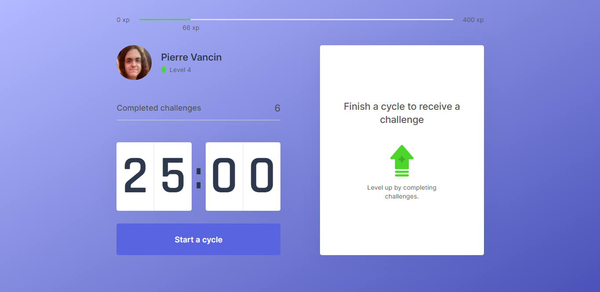

<h1 align="center">
  
</h1>

<p align="center">
  <a href="#-technologies">Tech</a>&nbsp;&nbsp;&nbsp;|&nbsp;&nbsp;&nbsp;
  <a href="#-project">Project</a>&nbsp;&nbsp;&nbsp;|&nbsp;&nbsp;&nbsp;
  <a href="#-layout">Layout</a>&nbsp;&nbsp;&nbsp;|&nbsp;&nbsp;&nbsp;
  <a href="#-run">How to run</a>&nbsp;&nbsp;&nbsp;|&nbsp;&nbsp;&nbsp;
  <a href="#-license">License</a>
</p>

<p align="center">
  

 
</p>

<br>

<p align="center">
  
</p>

## ✨ Technologies

This project is developed with the following technologies:

- [React](https://reactjs.org)
- [Next.js](https://nextjs.org/)
- [Node.js](https://nodejs.org/en/)
- [TypeScript](https://www.typescriptlang.org/)
- [Cookies](https://github.com/js-cookie/js-cookie)

## 💻 Project

Move.it is an app that unites the pomodoro technique with physical exercises for those who need to spend a lot of time in front of the computer.

## 🔖 Layout

The project layout is avaliable in [this link](https://www.figma.com/file/ge20pu3ofMOKoliUyKx1Nl/Move.it-1.0).

## 🚀 Run

- Clone this repository
- Install the dependencies with `yarn`
- Run the development server:

```bash
npm run dev
# or
yarn dev
```

Open [http://localhost:3000](http://localhost:3000) with your browser to see the result.

There's also an production version running in Vercel, that can be acessed through [this link](https://move-it-pievancin.vercel.app/).

## 📄 Licence

This project is under the MIT License. See the file [LICENSE](LICENSE.md) for more details.

---

This is a [Next.js](https://nextjs.org/) project bootstrapped with [`create-next-app`](https://github.com/vercel/next.js/tree/canary/packages/create-next-app).

## Learn More

To learn more about Next.js, take a look at the following resources:

- [Next.js Documentation](https://nextjs.org/docs) - learn about Next.js features and API.
- [Learn Next.js](https://nextjs.org/learn) - an interactive Next.js tutorial.

You can check out [the Next.js GitHub repository](https://github.com/vercel/next.js/) - your feedback and contributions are welcome!

## Deploy on Vercel

The easiest way to deploy your Next.js app is to use the [Vercel Platform](https://vercel.com/new?utm_medium=default-template&filter=next.js&utm_source=create-next-app&utm_campaign=create-next-app-readme) from the creators of Next.js.

Check out our [Next.js deployment documentation](https://nextjs.org/docs/deployment) for more details.

---

Made with ♥ by Pierre Vancin 👋🏻 Inspired by Rocketseat 🚀, with many thanks to the amazing instructor [Diego Fernandes](https://github.com/diego3g) who taught me a lot.
